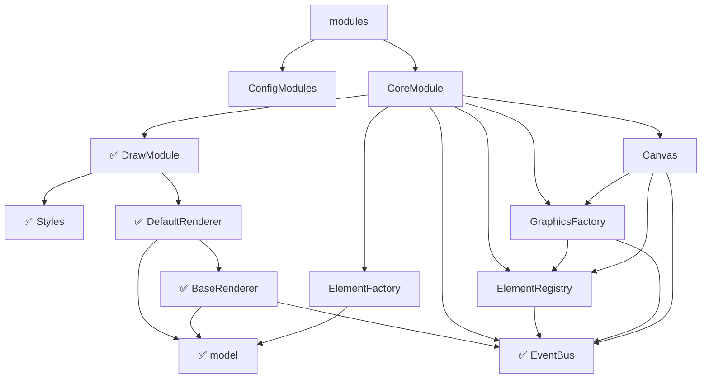

# DefaultRenderer

定义了一个默认的 Renderer，在没有外部定义 Renderer 的时候使用。

```ts {23}
declare module "diagram-js/lib/draw/DefaultRenderer" {
  import Styles from "diagram-js/lib/draw/Styles"
  import { Connection, GraphElement } from "diagram-js/lib/model"
  import { IRenderer } from "diagram-js/lib/draw/BaseRenderer"
  import EventBus from "diagram-js/lib/core/EventBus"
  export class DefaultRenderer implements IRenderer {
    constructor(eventBus: EventBus, styles: Styles)
  }
}
```

到这里为止 `DrawModule` 就全部讲完了。可以回看下目录：


