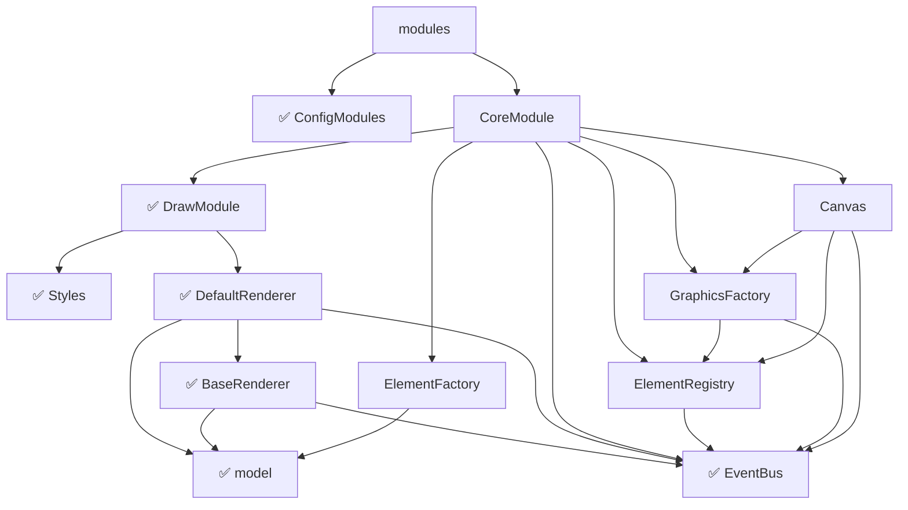

# DrawModule

```js
export default {
  __init__: [ 'defaultRenderer' ],
  defaultRenderer: [ 'type', DefaultRenderer ],
  styles: [ 'type', Styles ]
};
```

可以看到，在载入 `DrawModule` 的时候会初始化 `defaultRenderer`，这会将 `DefaultRenderer` 作为默认的渲染器注册到 injector 中。

:::tip
[何不尝试实现一个自己的 Renderer？](../../blog/custom-renderer)
:::

---

到这里为止 `DrawModule` 就全部讲完了。可以回看下目录：



接下来依次讲 `ElementFactory`、`ElementRegistry`、`GraphicsFactory` 和 `Canvas`。
