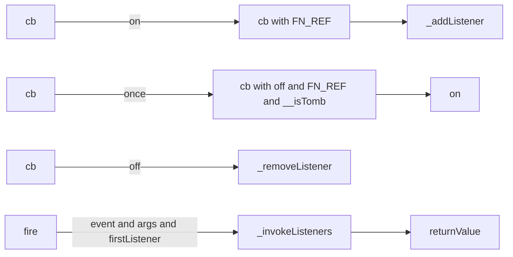

# EventBus

事件总线

```ts
declare module "diagram-js/lib/core/EventBus" {
  export interface InternalEvent {
    type: string
    cancelBubble: boolean
    defaultPrevented: boolean
    stopPropagation(): void
    preventDefault(): void
    init(data: any): void
  }
  export type EventCallback = (
    e: InternalEvent,
    ...args: any[]
  ) => void
  /**
   * A general purpose event bus.
   */
  export default class EventBus {
    /**
     * Register an event listener for events with the given name.
     */
    on(
      events: string | string[],
      priority: number,
      callback: EventCallback,
      that: any
    ): void
    on(events: string | string[], callback: EventCallback, that: any): void

    /**
     * Register an event listener that is executed only once.
     */
    once(
      events: string | string[],
      priority: number,
      callback: EventCallback,
      that: any
    ): void
    once(events: string | string[], callback: EventCallback, that: any): void

    /**
     * Removes event listeners by event and callback. If no callback is given,
     * all listeners for a given event name are being removed.
     */
    off(events: string | string[], callback?: EventCallback): void

    /**
     * Create an EventBus event.
     */
    createEvent(data: any): InternalEvent

    /**
     * Fires a named event.
     */
    fire<T = any>(type: string, data: T, ...args: any[]): any
    fire<T extends { type: string }>(data: T, ...args: any[]): any
  }
}
```

实现了 eventBus 需要的 on/off/once/fire 的基本功能。

## 原理

:::info
一些很简单的就略过了，比如 `createEvent` 和 `handleError` 这种。
:::

### `on`

```js
EventBus.prototype.on = function(events, priority, callback, that) {

  // 检查并格式化参数

  var actualCallback = callback;

  if (that) {
    actualCallback = bind(callback, that);

    // make sure we remember and are able to remove
    // bound callbacks via {@link #off} using the original
    // callback
    actualCallback[FN_REF] = callback[FN_REF] || callback;
  }

  var self = this;

  events.forEach(function(e) {
    self._addListener(e, {
      priority: priority,
      callback: actualCallback,
      next: null
    });
  });
};
```

这里 `EventBus.prototype.on` 做了两件事：

1. 绑定 `callback` 的上下文。同时记住原始的 `callback` 到 `FN_REF` 上。因为 `off` 的时候要比对原始 `callback`。
2. 为每一个事件添加监听，`_addListenerp9ol;`。

### `once`

```js
EventBus.prototype.once = function(event, priority, callback, that) {
  var self = this;

  // 检查并格式化参数

  function wrappedCallback() {
    wrappedCallback.__isTomb = true;

    var result = callback.apply(that, arguments);

    self.off(event, wrappedCallback);

    return result;
  }

  // make sure we remember and are able to remove
  // bound callbacks via {@link #off} using the original
  // callback
  wrappedCallback[FN_REF] = callback;

  this.on(event, priority, wrappedCallback);
};
```

这里 `EventBus.prototype.once` 做了三件事：

1. 给 `callback` 包一层，在调用一次后 off 掉
2. 记录原始的 `callback`，用于 off
3. 调用 `on` 注册事件

`__isTomb` 是干什么的？留到 `_invokeListener` 里说。

### `off`

```js
EventBus.prototype.off = function(events, callback) {

  events = isArray(events) ? events : [ events ];

  var self = this;

  events.forEach(function(event) {
    self._removeListener(event, callback);
  });

};
```

`off` 就比较简单了，调用内部函数，取消监听

### `fire`

```js
EventBus.prototype.fire = function(type, data) {
  // 检查并格式化参数

  firstListener = this._listeners[type];

  if (!firstListener) {
    return;
  }

  // 准备事件参数 

  if (type !== originalType) {
    event.type = type;
  }

  try {
    returnValue = this._invokeListeners(event, args, firstListener);
  } finally {

    // reset event type after delegation
    if (type !== originalType) {
      event.type = originalType;
    }
  }

  // set the return value to false if the event default
  // got prevented and no other return value exists
  if (returnValue === undefined && event.defaultPrevented) {
    returnValue = false;
  }

  return returnValue;
};
```

主要干了这么几个事儿：

1. 取出 `listener`，如果没有直接返回。
2. 根据提供的 `type` 和 `data` 准备好事件参数。有个特例，如果 data 是 `InternalEvent` 类型的，需要判断下是否要临时修改 `event.type`。
3. 调用 `_invokeListeners`。
4. 如果没有返回值，且 `defaultPrevented`，需要返回一个 `false`。
5. 返回返回值

可以理解为基本在整理输入和输出的数据，没干什么复杂的事情。复杂的逻辑都在 `_invokeListeners` 里面。

### 小结一



所以接下来还有三个：

- `_addListener`
- `_removeListener`
- `_invokeListeners`

### `_addListener`

`EventBus` 的 listeners 存储是一个 `Record<eventName, listenerHead>` 结构。每一个 `listener` 是一个链表，高优先级的更接近 Head，结尾的 `listener.next` 是个 `null`。

`_addListener` 就是按照优先级，将 `newListener` 插入到链表的合适位置。

:::tip
源码的难度主要在于链表插入的实现。不会链表的同学可以叉出去了。
:::

### `_removeListener`

这个也就显而易见了，链表的删除。（叉出去？）

### `_invokeListener(s)`

#### `_invokeListeners`

```js
EventBus.prototype._invokeListeners = function(event, args, listener) {

  var returnValue;

  while (listener) {

    // handle stopped propagation
    if (event.cancelBubble) {
      break;
    }

    returnValue = this._invokeListener(event, args, listener);

    listener = listener.next;
  }

  return returnValue;
};
```

做了两件事：

1. 检查是否 bubbleCanceled，如果是，立即返回。就是阻止冒泡，停止执行后续的事件监听。
2. 否则依次调用 `_invokeListener`，**返回最后一个 listener 的返回值**（重要，这对以后正确使用 EventBus 很有帮助）。

#### `_invokeListener`

上来就看到了 `__isTomb`。回看之前的代码：

```js
function wrappedCallback() {
  wrappedCallback.__isTomb = true;

  var result = callback.apply(that, arguments);

  self.off(event, wrappedCallback);

  return result;
}
```

看到第一次 `callback` 调用后这个值被设为 `true`。看现在的代码：

```js
EventBus.prototype._invokeListener = function(event, args, listener) {

  var returnValue;

  if (listener.callback.__isTomb) {
    return returnValue;
  }
```

如果 `true` 直接返回，这可以保证 `wrappedCallback` 只被执行一遍，第二遍调用不会被执行，而是直接略过。[我猜可能是用来修复某一个 bug 的](https://github.com/bpmn-io/diagram-js/issues/524)。

接下来就是调用和处理返回值

```js
EventBus.prototype._invokeListener = function(event, args, listener) {

  var returnValue;

  if (listener.callback.__isTomb) {
    return returnValue;
  }

  try {

    // returning false prevents the default action
    returnValue = invokeFunction(listener.callback, args);

    // stop propagation on return value
    if (returnValue !== undefined) {
      event.returnValue = returnValue;
      event.stopPropagation();
    }

    // prevent default on return false
    if (returnValue === false) {
      event.preventDefault();
    }
  } catch (error) {
    if (!this.handleError(error)) {
      console.error('unhandled error in event listener', error);

      throw error;
    }
  }

  return returnValue;
};
```

如果有返回值就停止冒泡，如果返回了 `false` 就 `preventDefault`。再加上 `Errorhandler` 就是全部了。

- 这里的停止冒泡会导致一旦有任何的监听器返回了非 `undefined` 值，就会停止继续执行
- 如果被调用了 `preventDefault` 且返回的是 `undefined`，最终会返回 `false`。

### 小结二

所以 EventBus 实现的功能有：

- 事件监听的注册和解注册。
- 按照优先级从高到低依次执行监听函数，如果有返回值则返回。
- 提供 `stopPropagation` 方法，控制事件返回时机。
- 提供 `preventDefault` 方法，在返回 `undefined` 的情况下返回值。
