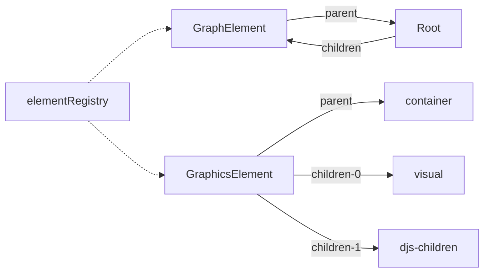

# GraphicsFactory

首先理解一个定义：GraphicsElement。在 GraphicsFactory 内部，会产生这样的 svg 结构：

```xml
<!-- Container -->
<g class="djs-group">

  <!-- GraphicsElement -->
  <g class="djs-element djs-(shape|connection|frame)">
    <g class="djs-visual">
      <!-- the renderer draws in here -->
    </g>

    <!-- extensions (overlays, click box, ...) goes here -->
  </g>

  <!-- children -->
  <g class="djs-children"></g>
</g>
```

一般 gfx 或者 GraphicsElement 指的是 `.djs-element` 这一层。

> 在 [ElementRegistry](./element-registry) 中提到的结构也是：
>
> ```ts
> type GraphicsElement = SVGGElement
> interface IElement{
>   element: GraphElement
>   gfx: GraphicsElement
> }
> ```

`visual` 一般指的就是 `.djs-visual` 这一层，是 svg 的可视部分。



---

接下来看类型定义

```ts
declare module "diagram-js/lib/core/GraphicsFactory" {
  import { ElementRegistry } from "diagram-js/lib/core/ElementRegistry"
  import { Connection, GraphElement, Shape } from "diagram-js/lib/model"
  import EventBus from "diagram-js/lib/core/EventBus"
  export type GraphicsElement = SVGGElement
  export class GraphicsFactory {
    constructor(eventBus: EventBus, elementRegistry: ElementRegistry)
    static $inject: ["eventBus", "elementRegistry"]
    create(
      type: string,
      element: GraphElement,
      parentIndex?: number
    ): GraphicsElement
    updateContainments(elements: GraphElement[]): void
    drawShape(visual: SVGGElement, element: Shape): SVGElement
    getShapePath(shape: Shape): string
    drawConnection(visual: SVGGElement, element: Connection): SVGElement
    getConnectionPath(connection: Connection): string
    update(type: string, element: GraphElement, gfx: GraphicsElement): void
    remove(element: GraphElement): void
  }
}
```

定义了一系列操作图形的方法：

- `create` 根据给定的类型和数据在对应 index 创建一个节点，GraphicsElement。创建的位置在 element.parent 对应的 djs-children 区域，可能是一个 RootContainer 也可能是一个 djs-children。
- `updateContainments` elements 涉及到的父元素的所有子 GraphicsElement.parent 进行排序。
- `drawXxx` 和 `getXxxPath` 会触发 `render.*` 的事件，可以看 [BaseRenderer](./base-renderer) 中提到的事件。
- `update` TODO
- `remove` 移除 GraphElement 对应的 GraphicsElement

:::note
有个问题：`create` 时，如果画 Root 没有 element.parent 怎么办？
:::
