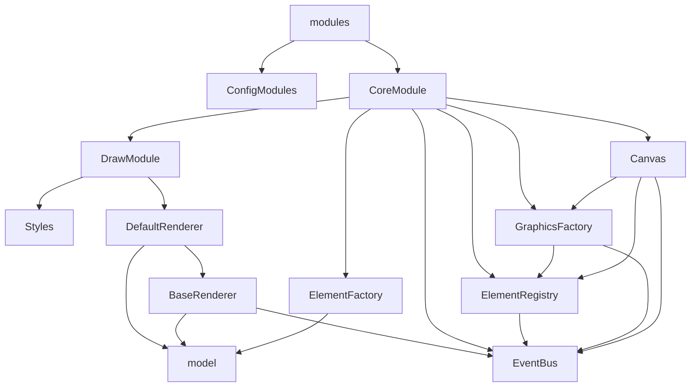

# diagram-js

从源码看起，定位到入口文件：

```js {2}
// index.js
export { default } from './lib/Diagram';
```

```js {3,9-13,17}
// lib/Diagram.js
export default function Diagram(options, injector) {
  this.injector = injector = injector || createInjector(options); // 看这里
  // ...
}

function createInjector(options) {
    options = options || {};
  var configModule = {
    'config': [ 'value', options ]
  };
  var modules = [ configModule, CoreModule ].concat(options.modules || []);
  return bootstrap(modules);
}

function bootstrap(modules) {
  var injector = new Injector(modules);
  injector.init();
  return injector;
}
```

沿着 `default export` > `Diagram` > `createInjector` > `bootstrap` > `new Injector` 的路径看下来。可以发现，最终新建了一个[`didi.Injector`](https://github.com/nikku/didi#example)。这个 `Injector` 注入了一系列 `modules` 来提供功能。

继续看 `modules`：

- `configModules`：提供配置项到 Injector 中
- `CoreModule`：是我们关注的重点

```js
// lib/core/index.js
export default {
  __depends__: [ DrawModule ], // 画画相关的
  __init__: [ 'canvas' ],
  canvas: [ 'type', Canvas ], // 画布
  elementRegistry: [ 'type', ElementRegistry ], // 元素注册表
  elementFactory: [ 'type', ElementFactory ], // 元素工厂
  eventBus: [ 'type', EventBus ], // 事件总线
  graphicsFactory: [ 'type', GraphicsFactory ] // 图形元素工厂
};
```

`CoreModule` 依赖 `DrawModule`。我们从依赖项看起

```js
// lib/draw/index.js
export default {
  __init__: [ 'defaultRenderer' ],
  defaultRenderer: [ 'type', DefaultRenderer ],
  styles: [ 'type', Styles ]
};
```

接下来就依次看这些 `Modules`，如果你不知道讲到哪了，可以回这页看目录：


