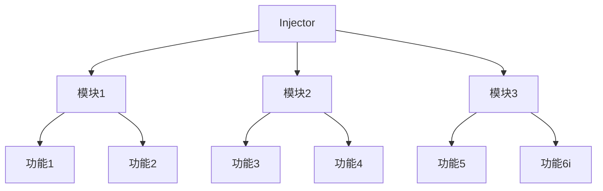
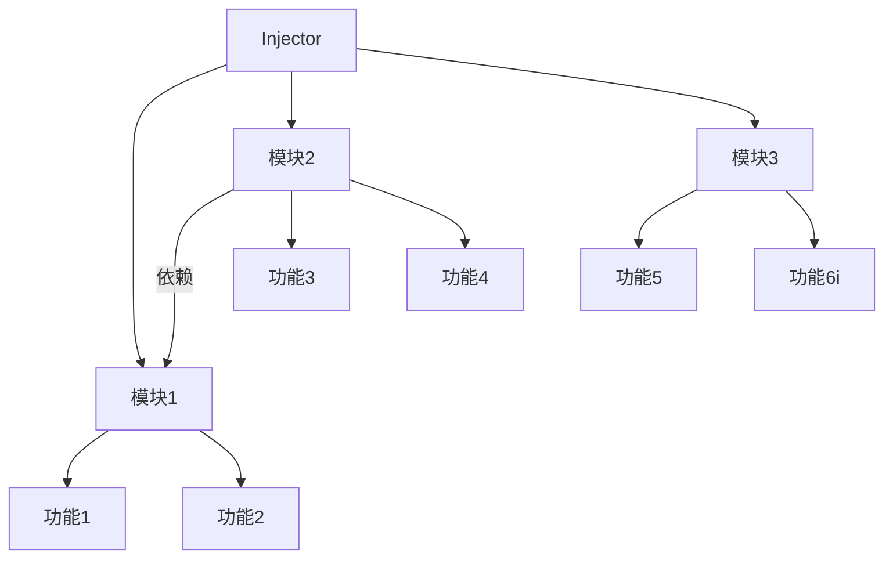
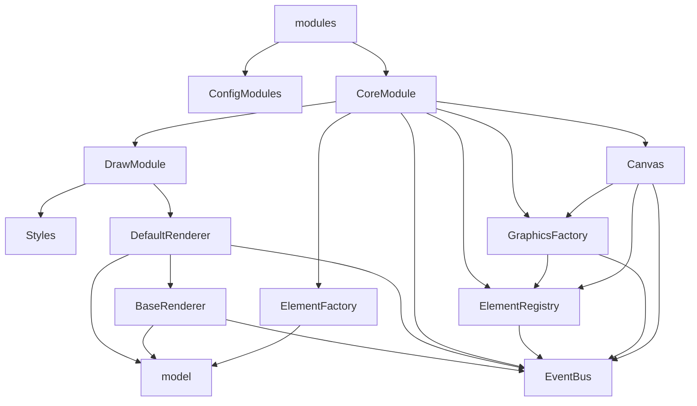

# diagram-js

`diagram-js` 提供了完整的绘图和控件功能。是 `bpmn-js` 编辑器图形部分的基础，同时也是 `bpmn-js` 整个框架的地基。两者的使用方式是极其相似的，学会如何使用 `diagram-js` 对于学习 `bpmn-js` 帮助极大。

## 创建一个 `diagram-js` 实例

```js
const djs = new Diagram({
  canvas: { container: document.getElementById("djs-canvas") },
  modules
});
```

只需要提供一个 HTML 元素作为容器，并且配置 modules（模块），就可以创建并开始使用一个 `diagram-js`。

## 功能

`diagram-js` 的核心是 `didi` 提供的 Injector。可以想象成一个注册中心，通过 key 注册或者获取相应的实例。每一个实例提供一些扩展功能。所有实例共同构成了 `diagram-js` 整体。



模块间也可能有依赖关系：



将具体的模块的名字填写到上图，就得到了 `diagram-js` 基础模块的全貌：



:::tip
别慌，只是数量大了些，并不需要你现在都掌握。需要了解哪个模块再去看就好。
:::

此外，`diagram-js` 还通过不同的 `features` 提供了更多丰富且复杂的高阶功能。例如「移动元素」、「剪切和粘贴」、「对齐」等等。

```txt
./lib/features
├── align-elements
├── attach-support
├── auto-place
├── auto-resize
├── auto-scroll
├── bendpoints
├── change-support
├── clipboard
├── connect
├── connection-preview
├── context-pad
├── copy-paste
├── create
├── distribute-elements
├── dragging
├── editor-actions
├── global-connect
├── grid-snapping
├── hand-tool
├── hover-fix
├── interaction-events
├── keyboard
├── keyboard-move-selection
├── label-support
├── lasso-tool
├── modeling
├── mouse
├── move
├── ordering
├── outline
├── overlays
├── palette
├── popup-menu
├── preview-support
├── replace
├── resize
├── root-elements
├── rules
├── search-pad
├── selection
├── snapping
├── space-tool
├── tool-manager
├── tooltips
└── touch
```

:::tip
再次！别慌，只是数量大了些，并不需要你现在都掌握。需要了解哪个模块再去看就好。
:::

## 如何使用一个功能

假设我们知道 `elementFactory.create` 可以创建一个图形。

首先，获取这个模块：

```js
const elementFactory = djs.get('elementFactory')
```

之后，根据 API 使用这个功能：

```js
const shape = elementFactory.create("shape", {
  id: "1",
  width: 100,
  height: 100
});
```

:::info
由于 `bpmn-js` 也是基于 `Injector`（准确的说，是扩展了 `diagram-js`），这套方法不仅 `diagram-js` 适用，拿到 `bpmn-js` 同样适用。
:::

## 接下来该做什么

是时候讲述如何查阅本文档了。

如果你需要使用到（或者想要了解）某个功能如何使用，只需要找到对应的章节，然后查看概念讲解、 API 文档或者源码解析，一般都可以找到你想要的。事实上，我在开发中也是这么做的，如果实在不行，可以尝试直接阅读源码。

## 源码分析

:::tip
在看源码前建议先 clone 源码到本地以方便查看
:::

### 入口

定位到入口文件：

```js {1} title="index.js"
export { default } from './lib/Diagram';
```

```js {2,8-12,16} title="lib/Diagram.js"
export default function Diagram(options, injector) {
  this.injector = injector = injector || createInjector(options); // 看这里
  // ...
}

function createInjector(options) {
    options = options || {};
  var configModule = {
    'config': [ 'value', options ]
  };
  var modules = [ configModule, CoreModule ].concat(options.modules || []);
  return bootstrap(modules);
}

function bootstrap(modules) {
  var injector = new Injector(modules);
  injector.init();
  return injector;
}
```

沿着 `default export` > `Diagram` > `createInjector` > `bootstrap` > `new Injector` 的路径看下来。可以发现，实际生效的代码是使用配置好的模块新建了一个[`didi.Injector`](https://github.com/nikku/didi#example)。这个 `Injector` 注入了一系列 `modules` 来提供功能。

### 模块

继续看 `modules`：

```js {6} title="lib/Diagram.js"
function createInjector(options) {
    options = options || {};
  var configModule = {
    'config': [ 'value', options ]
  };
  var modules = [ configModule, CoreModule ].concat(options.modules || []);
  return bootstrap(modules);
}
```

- `configModules`：提供配置项到 Injector 中
- `CoreModule`：是我们关注的重点

```js title="lib/core/index.js"
export default {
  __depends__: [ DrawModule ], // 画画相关的
  __init__: [ 'canvas' ],
  canvas: [ 'type', Canvas ], // 画布
  elementRegistry: [ 'type', ElementRegistry ], // 元素注册表
  elementFactory: [ 'type', ElementFactory ], // 元素工厂
  eventBus: [ 'type', EventBus ], // 事件总线
  graphicsFactory: [ 'type', GraphicsFactory ] // 图形元素工厂
};
```

`CoreModule` 依赖 `DrawModule`。

:::tip

- `__depends__` 代表依赖项
- `__init__` 代表在注册到 Injector 时需要初始化的实例

:::

```js title="lib/draw/index.js"
export default {
  __init__: [ 'defaultRenderer' ],
  defaultRenderer: [ 'type', DefaultRenderer ],
  styles: [ 'type', Styles ]
};
```

这些模块就是上文提到的基础模块
