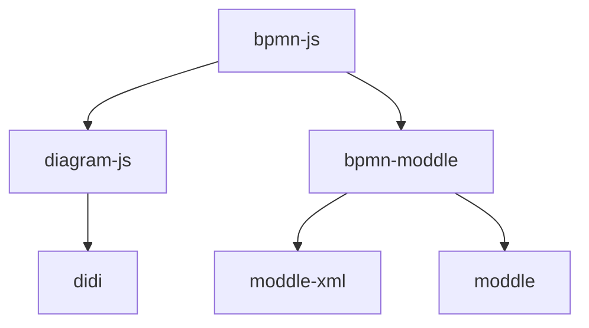

# 写在开始

这个文档是写给 bpmn-js 的系列文档。记录一些自己使用过程中的经验。可能是源码解析，也可能记录一些 API。

## 为什么

开始使用 bpmn-js 后，最大的问题就是：找不到文档。主要的文档来源有以下几个：

1. 官方示例：<https://github.com/bpmn-io/bpmn-js-examples>
2. 官方项目
   1. [bpmn-js-bpmnlint](https://github.com/bpmn-io/bpmn-js-bpmnlint)
   2. [bpmn-auto-layout](https://github.com/bpmn-io/bpmn-auto-layout)
   3. [更多](https://github.com/orgs/bpmn-io/repositories)
3. 官方论坛：<https://forum.bpmn.io/>
4. 博客分享（随便选了一些）
   1. <https://juejin.cn/post/7064485347186442271>
   2. <https://juejin.cn/post/7117481147277246500#heading-33>
   3. <https://juejin.cn/post/6844904017567416328>
5. 源码

依然有很多问题：

- 官方的材料都比较抽象，只给了代码，但是没有讲相关的概念。而且不全面。不利于理解 bpmn-js 相关的概念。
- 网友们给的参考针对解决问题的居多，大多数讲述如何实现一个 Vue/React 的 bpmn。对于高级的自定义业务支持没有很详细的讲解（如果有，欢迎补充链接）。
- 源码最全面，但是读懂是需要成本的

没有 API 文档就没有详细的使用参考。总会出现突然冒出来一个 API 发现好像可以用，又好像不太可以用的情况。

所以决定写一个文档站，尽可能详细描述下 bpmn-js 的系列 API。

## 目标读者

希望你：

- 想要了解 bpmn-js 的相关概念
- 想要了解 bpmn-js 的详细 API
- 想要了解 bpmn-js 的实现和原理

而不是：

- 想要一个 bpmn-js 的 Vue/React/Xxx 封装
- ~~想要一个 bpmn-js 使用教程~~ [看 Blog，开始写了](../blog)
- 想要了解 bpmn 本身的相关概念（[可以看这里](https://docs.awspaas.com/reference-guide/aws-paas-process-reference-guide/index.html)）

## 目录

对于 bpmn-js 来说。有以下的模块依赖关系：

图中我只列出了一些重要的模块，工具模块被省略了。

- `didi`: [控制反转(IoC) 和依赖注入(DI)](https://en.wikipedia.org/wiki/Inversion_of_control)工具
- `diagram-js`: 基于 `didi` 实现的作图工具，提供了基础的画布和控件功能，同时通过插件提供了一系列预制功能。
- `moddle`: 用于管理对象属性和对象关系的工具
- `moddle-xml`: 用于将对象结构和 xml 文件互相转换的工具
- `bpmn-moddle`: 用于 bpmn 的 `moddle`。有 xml 导入导出功能和 bpmn 元素定义。

除了控制反转外，会依次讲解。

:::info
控制反转已经有大量文章再讲了，相信他们讲得比我好得多

dmn 还有其他一些工具由于我业务上没用过，就不写了，如果有小伙伴有接触，欢迎 PR
:::
