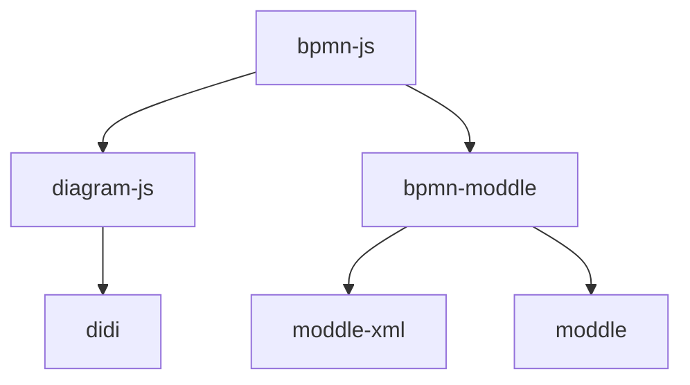

# 写在开始

这是写给 bpmn-js 的系列文档。尝试记录基于 bpmn-js 进行开发所需的知识。

## 为什么

开始使用 bpmn-js 后，最大的问题就是：找不到文档。主要的文档来源有以下几个：

1. 官方示例：<https://github.com/bpmn-io/bpmn-js-examples>
2. 官方项目
   1. [bpmn-js-bpmnlint](https://github.com/bpmn-io/bpmn-js-bpmnlint)
   2. [bpmn-auto-layout](https://github.com/bpmn-io/bpmn-auto-layout)
   3. [更多](https://github.com/orgs/bpmn-io/repositories)
3. 官方论坛：<https://forum.bpmn.io/>
4. 博客分享（随便选了一些）
   1. <https://juejin.cn/post/7064485347186442271>
   2. <https://juejin.cn/post/7117481147277246500#heading-33>
   3. <https://juejin.cn/post/6844904017567416328>
5. 源码

依然有很多问题：

- 官方的材料：比较抽象，只有代码没有相关概念。
- 网络参考资料：过多针对业务，对 API 讲解较少。
- 源码：全面，但读懂需要成本。

## 目标

针对以上的问题，希望：

- 尽可能全面介绍基于 bpmn-js 开发需要了解的基础概念。
- 尽可能详细得对 API 进行标注。
- 尽可能全面讲解源码。

每一篇文档都会包含上述三个部分。

## 谁适合这个文档

希望你：

- 想要了解 bpmn-js 的相关概念
- 想要了解 bpmn-js 的详细 API
- 想要了解 bpmn-js 的实现和原理

而不是：

- 想要一个 bpmn-js 的 Vue/React/Xxx 封装
- ~~想要一个 bpmn-js 使用教程~~ [看 Blog，开始写了](../blog)
- 想要了解 bpmn 本身的相关概念（[可以看这里](https://docs.awspaas.com/reference-guide/aws-paas-process-reference-guide/index.html)）

## 目录

对于 bpmn-js 来说，重要的模块依赖关系如下：

- `didi`: [控制反转(IoC) 和依赖注入(DI)](https://en.wikipedia.org/wiki/Inversion_of_control)工具
- `diagram-js`: 作图工具，提供了基础的画布和控件功能，同时通过插件和强大的扩展系统提供一系列能力。
- `moddle`: 用于管理对象属性和对象关系的工具
- `moddle-xml`: 用于将对象结构和 xml 文件互相转换的工具
- `bpmn-moddle`: 读写 BPMN 2.0 xml 提供 BPMN 元数据和数据模型。

为了理解 bpmn-js 开发和工作的方式，后文会逐一讲解上述模块的作用和使用方式。

:::info
关于 `didi` 请查阅官方文档：<https://github.com/nikku/didi>
:::
